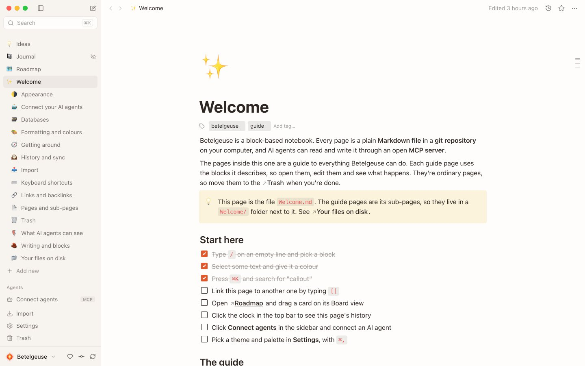

# Betelgeuse

A beautiful workspace for notes, docs and databases that stays yours. Every page is a plain Markdown file on your computer, and your AI agents can read only the pages you share.

[Website](https://betelgeuse.devianlabs.com) · [Download](https://github.com/devian-labs/betelgeuse/releases/latest) · [User guide](src-tauri/seed/Welcome.md) · [Contributing](CONTRIBUTING.md)

[](https://github.com/devian-labs/betelgeuse/actions/workflows/ci.yml)
[](LICENSE)

<picture>
  <source media="(prefers-color-scheme: dark)" srcset="lander/public/assets/editor-dark-1440.jpg">
  
</picture>

## Why Betelgeuse

- **Easy to use.** Type `/` for any block: headings, to-dos, callouts, tables, columns and more. Build databases with table, board and calendar views.
- **Your files, on your disk.** Pages are Markdown files in a folder you own, saved to git as you go. Open them in any editor, any time.
- **AI on your terms.** Connect Claude, Cursor or any MCP client and they can search, read and update your notes. You choose which pages they see, and you can undo anything they change.

## Install

**Download** the latest version for macOS, Windows or Linux from [Releases](https://github.com/devian-labs/betelgeuse/releases/latest).
The builds aren't code-signed yet, so the first time you open the app, your OS asks you to confirm.

- **macOS:** System Settings → Privacy & Security → **Open Anyway**
- **Windows:** **More info** → **Run anyway**

**Or build it yourself.** You need [git](https://git-scm.com), [Node.js 20+](https://nodejs.org) and [Rust](https://rustup.rs). The script checks for anything else it needs.

```sh
git clone https://github.com/devian-labs/betelgeuse && cd betelgeuse
./scripts/install.sh          # macOS and Linux
.\scripts\install.ps1         # Windows (PowerShell)
```

## Connect your AI agents

Click **Connect agents** in the sidebar and copy the setup for Claude Code, Claude Desktop, Cursor or any other MCP client. It shows the exact command for your install. From a source checkout, it looks like this:

```sh
claude mcp add betelgeuse -- node /path/to/betelgeuse/mcp/dist/index.js --workspace ~/Betelgeuse
```

Every change an agent makes is saved as its own git commit, so you can review or undo it. Hide any page from agents in its `•••` menu. [More about agents](src-tauri/seed/Welcome/Connect%20your%20AI%20agents.md).

## Learn more

Betelgeuse opens with a Welcome guide that explains every feature. You can also [read it here](src-tauri/seed/Welcome.md):

[Writing and blocks](src-tauri/seed/Welcome/Writing%20and%20blocks.md) ·
[Databases](src-tauri/seed/Welcome/Databases.md) ·
[History and sync](src-tauri/seed/Welcome/History%20and%20sync.md) ·
[What AI agents can see](src-tauri/seed/Welcome/What%20AI%20agents%20can%20see.md) ·
[Import](src-tauri/seed/Welcome/Import.md) ·
[Your files on disk](src-tauri/seed/Welcome/Your%20files%20on%20disk.md) ·
[Keyboard shortcuts](src-tauri/seed/Welcome/Keyboard%20shortcuts.md)

## Status

Betelgeuse is an early preview. Search is basic, databases don't have formulas or relations yet, and there's no sharing or comments. [Ideas and bug reports](https://github.com/devian-labs/betelgeuse/issues) are very welcome.

## Contributing

We'd love your help. Start with [CONTRIBUTING.md](CONTRIBUTING.md) and look for [good first issues](https://github.com/devian-labs/betelgeuse/issues?q=is%3Aopen+label%3A%22good+first+issue%22).

## License

[MIT](LICENSE). Built by [Devian Labs](https://devianlabs.com). If Betelgeuse is useful to you, [sponsoring](https://github.com/sponsors/devian-labs) helps fund signed builds.
